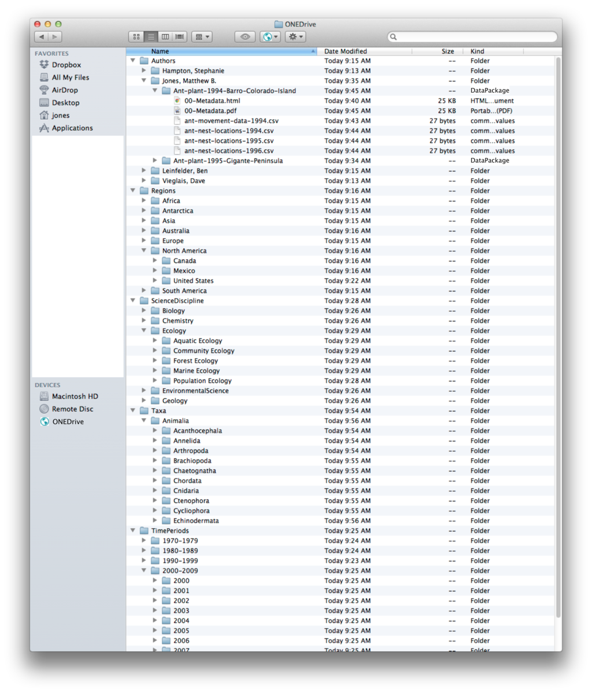
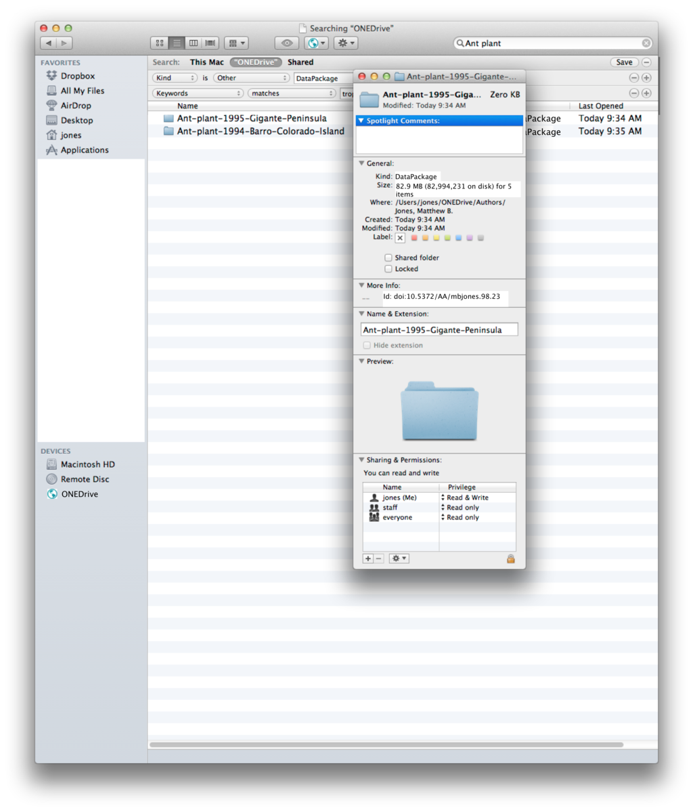
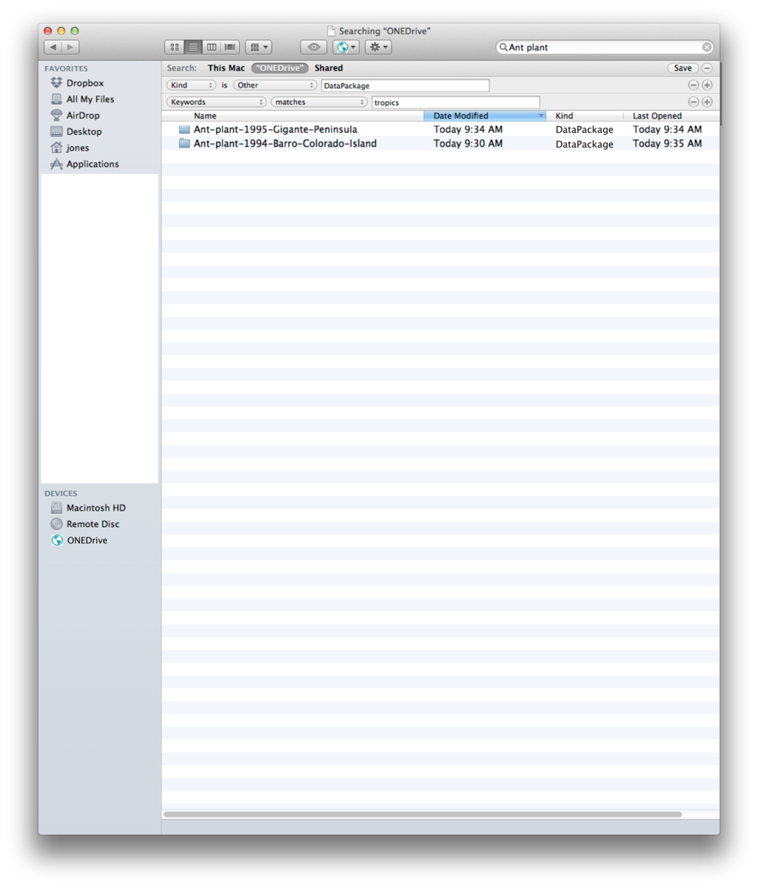
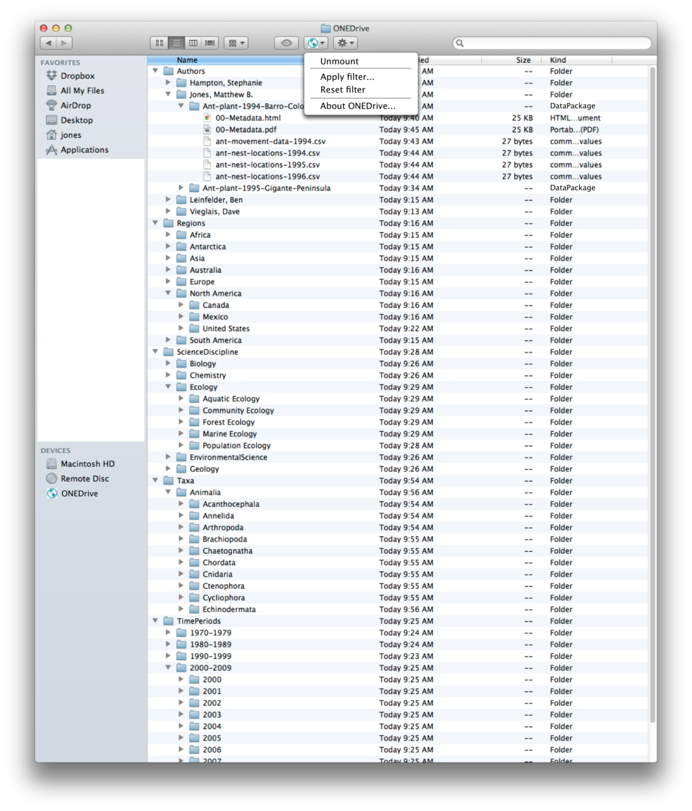
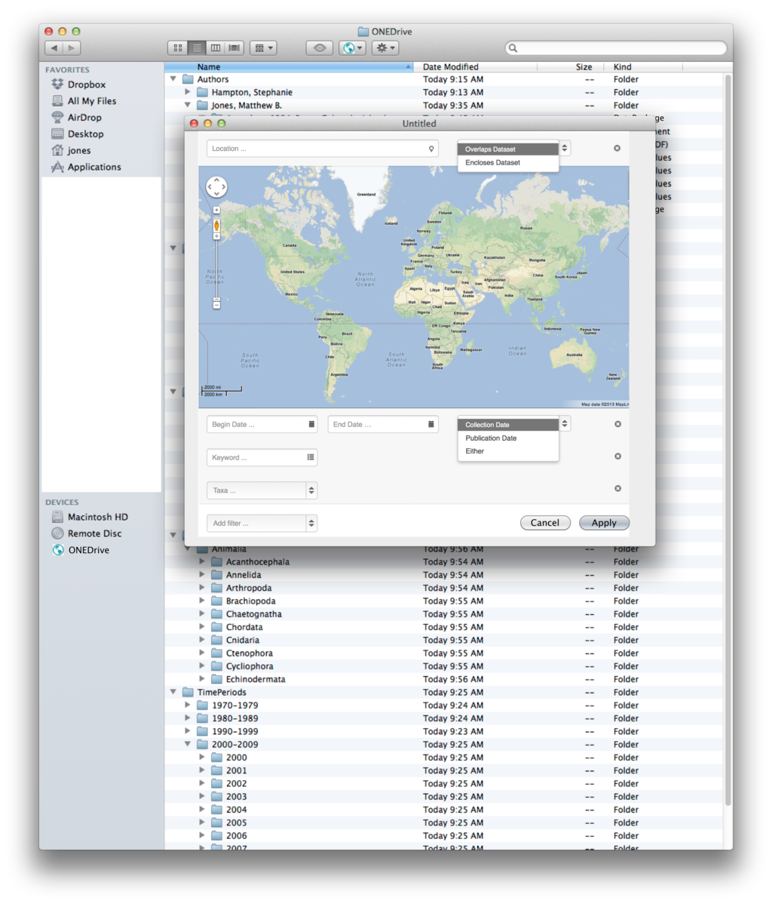

OS specific integration
=======================

As an extension of the standard filesystem, ONEDrive is by nature a platform specific user interface. Here are several user interface mockups that take advantage of the user interface approach on each platform on which we plan to operate.

Mac OS X
--------
Mac OS X displays files using the Finder. The standard Finder view would be used to display a set of browse hierarchies representing the authors, locations, time periods, taxa, etc. associated with the data sets. At the leaves of this folder hierarchy are Data Packages, each of which is represented as a folder containing the science metadata for the package in an HTML file and each of the data files in their natural format, and with an appropriate filename (e.g., with proper extension).

Basic folder view
~~~~~~~~~~~~~~~~~
The basic folder view shows only browse hierarchies that are sensible from a user perspective. These will need to be controlled hierarchies that are cleaned up from our metadata indexing corpus. The ONEDrive mount point is shown in the Finder window on the left.

   *Figure 1.* Mac OS X Mockup of the hierarchical folder view.

Get Info Dialog used to display System Metadata
~~~~~~~~~~~~~~~~~~~~~~~~~~~~~~~~~~~~~~~~~~~~~~~
Package and file-oriented metadata that comes from the DataONE SystemMetadata corpus would be added as extended attributes to the file and folders, so that the standard Get Info dialog box can show these metadata fields. Note the presence of the DOI identifier listed in the middle.

   *Figure 2.* Mac OS X Get Info dialog is used to display system metadata.

Filtering approach 1: Spotlight
~~~~~~~~~~~~~~~~~~~~~~~~~~~~~~~
In our first UI for filtering, we use the built-in Mac OS X Spotlight filtering system that provides an UI for specifying search filters and applies them to the extended attributes of the items.

   *Figure 3.* Mac OS X Mockup of the filter UI showing a restricted set of data packages.

Filtering approach 2: Filter Dialog
~~~~~~~~~~~~~~~~~~~~~~~~~~~~~~~~~~~
Many users are unaware of the Spotlight filter UI described above, and don't naturally find it in the Finder interface. A potential alternative is to provide our own Filter Dialog that is accessed via a ONEDrive dropdown menu. The following two screenshots show first the dropdown menu and then a mockup of a potential filtering dialog box.

   *Figure 1.* Mac OS X Mockup showing the ONEDrive dropdown menu.

The use of a filtering dialog box gives us a lot of flexibility in laying out filter widgets, including the capability to use map widgets and other UI widgets to make constructing filters powerful. Once a filter is applied, the view in the ONEDrive window is constrained to display only packages that match the filter criteria.

   *Figure 1.* Mac OS X Mockup showing the filter dialog for constraining what is shown in the window.
