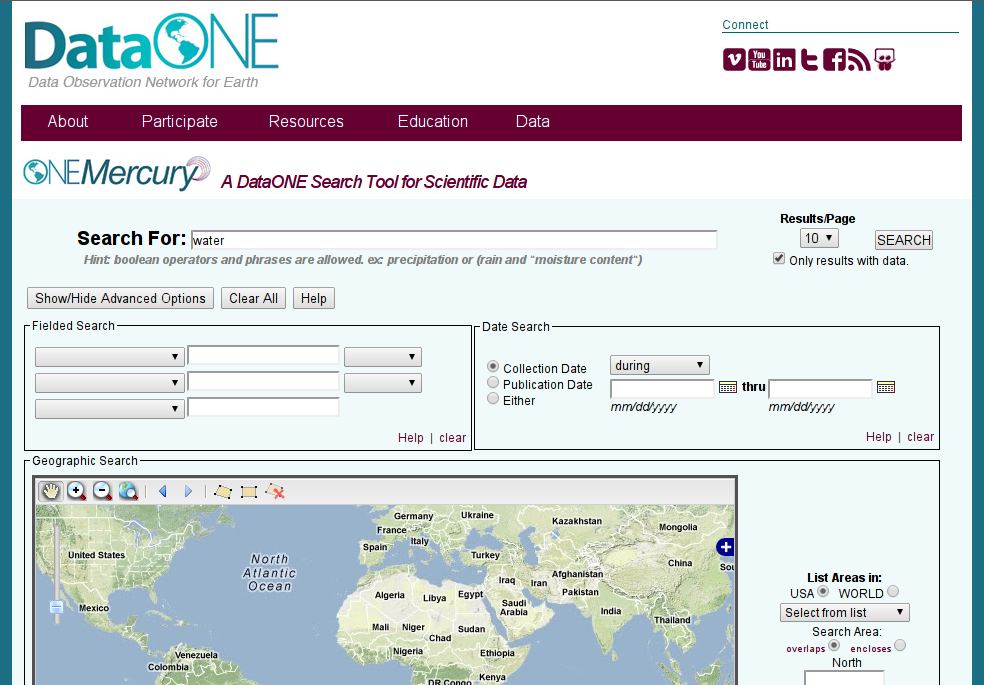
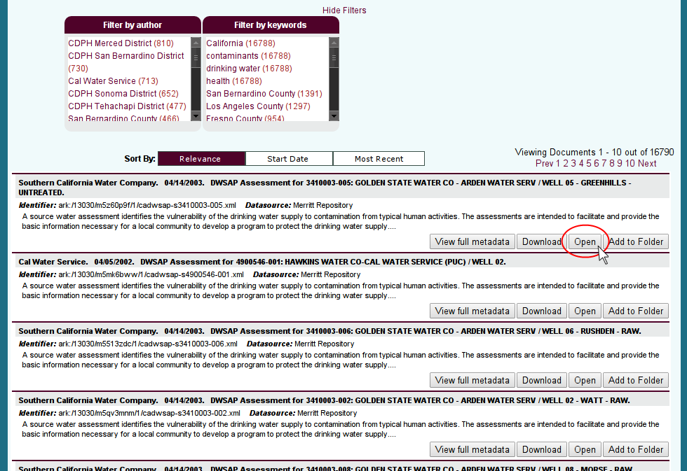
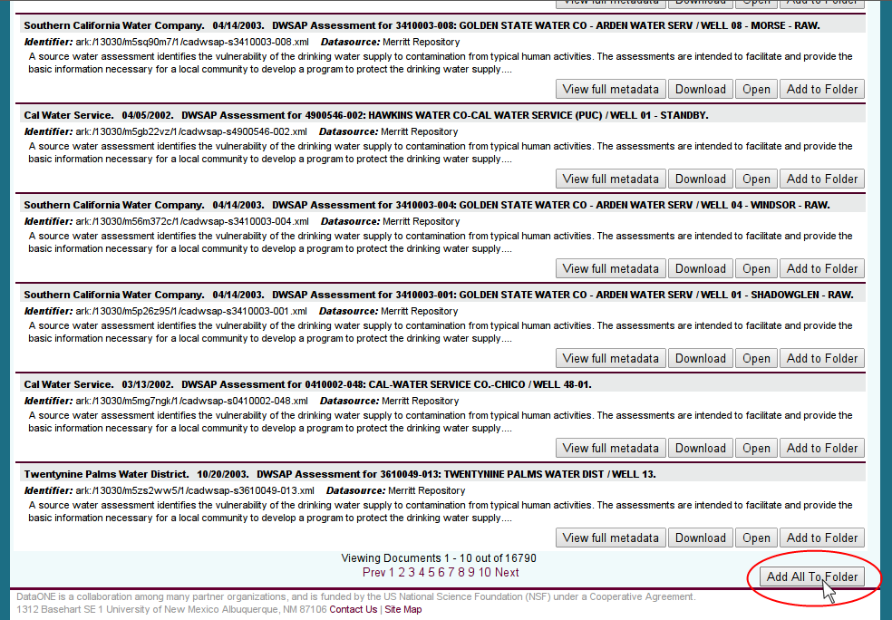

ONEMercury Integration
======================

Search/discovery for ONEDrive can be exposed in a web interface based on ONEMercury. The interface would let users search for and discover objects. After finding the objects, they would be accessed through ONEDrive.

ONEMercury
----------

   *Figure 1.* Regular search/discovery in ONEMercury

\
\
\

Opening objects
---------------

* Single objects in the search results can be opened directly with the local
  application to which the given filetype is associated.

   *Figure 2.* Opening a single object

\
\
\

Saving objects
---------------

* A single object can be added to user defined folders.

* The user can use the "New folder" option to a new folder and add the first
  object to it in the same operation.

   *Figure 3.* Saving a single object

\
\
\

* All of the search results can be added to a folder.

* It is also possible to add a function to create an RSS or Atom feed for the
  search results so that the user can be notified when new objects that match
  the search parameters are added to DataONE.

   *Figure 4.* Adding search results to folder

\
\
\

* The folders created in ONEMercury and the search results stored in them become
  visible in ONEDrive.

   *Figure 5.* ONEDrive view of files and folders
